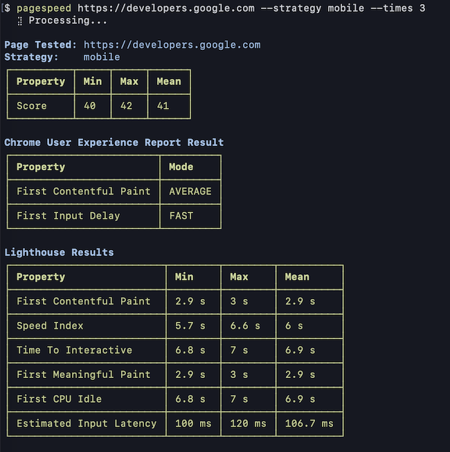

# pagespeed
 
[](https://nest.land/package/your-module)

CLI tool and API Wrapper for the [PageSpeed Insights API](https://developers.google.com/speed/docs/insights/v5/get-started) written in Deno
> Inspired by https://github.com/GoogleChromeLabs/psi

## Screen Shot


## Module
### Usage
```typescript
import { runPagespeed } from "https://deno.land/x/pagespeed/mod.ts";

const data = await runPagespeed("https://developers.google.com", {
  strategy: "mobile",
});

console.log(data);
```

### Options
| Option | Type | Default | Description |
|-------|--------------------|-----------|----------------|
| `strategy` | `string` | `desktop` | The analysis strategy |
| `key` | `string` | ` ` | API Key |

## CLI
## Install
```
$ deno install --allow-net --name pagespeed mod.ts
```

## Usage
```
pagespeed https://developers.google.com --strategy mobile --times 3
```

### Options
```shell
Usage: pagespeed [url] [options]

Options:
  -h, --help: display help message
  -s, --strategy: The analysis strategy (desktop or mobile) to use, and desktop is the default
  -k, --key: API Key(Optional)
  -t, --times: Number of times
  -i, --interval: Time interval(ms)
```

## Testing
```shell
$ deno test --allow-net
```

## Code formatter
```shell
$ deno fmt
```

## License
[MIT LICENSE](LICENSE)